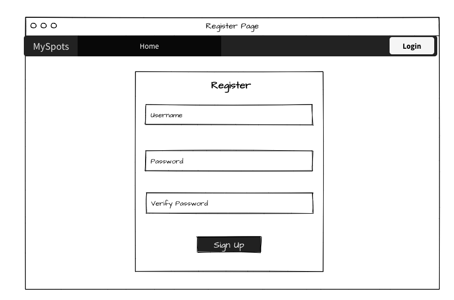

# MySpots

- [App Link](https://armyspot.herokuapp.com/)

 

## App Summary

Welcome to MySpots!

MySpots is a place where users can store information of a great adventure spot that they discovered. For example if you go hiking and find a spot with waterfall then you can quickly open up the MySpots and it will grab your current location and you can save that spot for future references!  

This gives users a spot to save all their favorite locations in one spot!

 

## User Stories

&nbsp;&nbsp;&nbsp;As a user…
- I want to be able to register with a username and password to create a user account 
- I want to be able to log in once I am a registered user
- I want to be able to see my list of saved spots
- I want to be able to create/update/delete spot(s) page(s) that I have created
- I want to be able to edit spot pages
- I want to be able to upload images of the spots
- I want to see all my spots in a map view 
- I want to be able to Log out

 

## WireFrames 
  
  
   
   
   
   

 
 

## ERD  

## Technologies Used
- Python
- Django
- Amazon S3
- PostgreSQL
- Heroku
- Folium